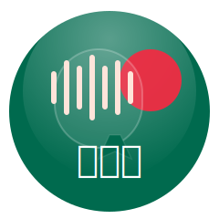
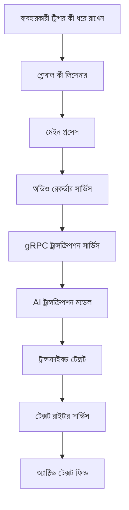

<div align="center">
  

  <h3>যে কোনো স্থানে স্মার্ট ভয়েস ডিক্টেশন</h3>

  <p>
    <strong>কথা</strong> হল একটি স্মার্ট ভয়েস অ্যাসিস্ট্যান্ট, যা যেকোনো অ্যাপে সরাসরি আপনার কথাকে টেক্সটে রূপান্তর করে। শুধু ট্রিগার কী ধরুন, কথা বলুন এবং দেখুন শব্দগুলো স্বয়ংক্রিয়ভাবে লেখা হচ্ছে।
  </p>

  <p>
    <a href="https://github.com/kothagpt/kotha/releases">
      
    </a>
    
    
  </p>

  <p>
    <em>বাংলা ভাষায়, সহজ, দ্রুত এবং প্রাইভেসি ফ্রেন্ডলি।</em>
  </p>

  
</div>

---

## 🌟 বৈশিষ্ট্যসমূহ

<div align="center">
  <table>
    <tr>
      <td align="center">
        🎙️<br>
        <strong>সার্বজনীন ডিক্টেশন</strong><br>
        যেকোনো অ্যাপে কাজ করে, রিয়েল-টাইম ট্রান্সক্রিপশন
      </td>
      <td align="center">
        🧠<br>
        <strong>স্মার্ট ও অভিযোজ্য</strong><br>
        কাস্টম ডিকশনারি, প্রাসঙ্গিকতা সচেতনতা
      </td>
      <td align="center">
        ⚙️<br>
        <strong>কাস্টমাইজেশন</strong><br>
        নমনীয় শর্টকাট ও অডিও পছন্দ
      </td>
      <td align="center">
        💾<br>
        <strong>ডেটা ম্যানেজমেন্ট</strong><br>
        নোটস, ইতিহাস, ক্লাউড সিঙ্ক
      </td>
    </tr>
  </table>
</div>

---

## 🚀 দ্রুত শুরু

**প্রয়োজনীয়তা:**
- macOS 10.15+
- Node.js 20+ & Bun
- Rust টুলচেইন
- মাইক্রোফোন ও Accessibility অনুমতি

**ইনস্টলেশন:**
1. [সর্বশেষ রিলিজ ডাউনলোড করুন](https://github.com/kothagpt/kotha/releases)  
2. `.dmg` খুলে Applications-এ ড্র্যাগ করুন  
3. অনুমতি দিন (মাইক্রোফোন & Accessibility)  
4. অ্যাকাউন্ট লগইন করুন (Google, Apple, Github বা লোকাল)

**প্রথম ব্যবহার:**
- ট্রিগার কী সেট করুন (ডিফল্ট: `Fn + Space`)  
- মাইক্রোফোন পরীক্ষা করুন  
- ট্রিগার কী ধরে কথা বলুন  
- সেটিংস কাস্টমাইজ করুন

---

## 🛠️ ডেভেলপমেন্ট

```bash
git clone https://github.com/kothagpt/kotha.git
cd kotha
bun install
cp .env.example .env
./build-binaries.sh
cd server
bun install
bun run local-db-up
bun run db:migrate
bun run dev
cd ..
bun run dev
````

<div align="center">
  
</div>

---

## 🏗️ আর্কিটেকচার



---

## 🔒 প্রাইভেসি & সিকিউরিটি

* লোকাল প্রসেসিং (ভয়েস ডেটা ডিভাইসে থাকে)
* TLS এনক্রিপশন
* ন্যূনতম ডেটা সংগ্রহ
* ব্যবহারকারী নিয়ন্ত্রণ

---

## 🤝 অবদান রাখা

1. রিপোজিটরি Fork করুন
2. ফিচার ব্রাঞ্চ তৈরি করুন
3. পরিবর্তন কমিট করুন
4. পরীক্ষা করুন
5. Pull Request করুন

---

## 📄 লাইসেন্স

GNU General Public License (GPL)

---

## 🙏 কৃতজ্ঞতা

* Electron, React, Rust, gRPC, TailwindCSS
* [Electron React App](https://github.com/guasam/electron-react-app)

---

## 📞 সহায়তা

* [GitHub Discussions](https://github.com/kothagpt/kotha/discussions)
* [GitHub Issues](https://github.com/kothagpt/kotha/issues)
* [Website](https://www.kotha.khulnasoft.com)

```
